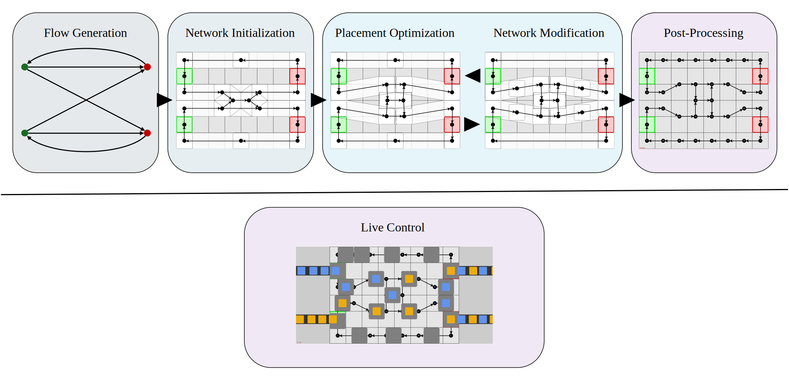

This Repository contains the Tech Report and Implementation accompanying the publication

# Interaction-Minimizing Roadmap Optimization for High-Density Multi-Agent Path Finding

The [Tech Report](Tech_Report.pdf) is based on the Master’s Thesis **Planning Magnetic Levitation Operating Strategies for PLC-Controlled Intralogistics**, which is tailored to the specific requirements of the [CORAS](https://www.somic-packaging.com/en/solutions/collating-and-grouping-systems/coras.html) collecting and grouping system. The provided [Implementation](./implementation/) has been used to generate the presented data.

# Abstract
Modern industry increasingly demands customizability from each element of their workflow and factories. A prominent example for this is the advent of smart Automated Guided Vehicles (AGV) in intralogistics tasks, which are able to autonomously navigate fields in an effort to optimally deliver products. One such application, and the central concern of this work, is the application of fleets of magnetically propelled movers to transport, collect, sort and group products between multiple stations of a larger factory assembly. Traditional approaches to this task make use of inflexible conveyor belts or pick-and-place machines, limited in their ability of to efficiently adapt to new requirements. Most state-of-the-art solutions for controlling fleets of AGVs rely on smart, distributed systems, which are able to independently make real-time routing decisions. However, most factories rely on centralized Programmable Logic Controllers (PLC), designed around proven technologies and bound to industry standards such as IEC 61131. This makes the adaptation and integration of modular approaches and consequently their customizability slow and complex.

This work presents an AGV control approach capable of offloading large parts of the computational expense into an offline preprocessing step, making use of an iterative force gradient optimization to lay out a graph of unidirectional lanes and a novel item sequence approach to efficiently ensure adherence to a specified product arrival order at the offloading points. Furthermore, a concept for a PLC-based, reusable and efficient real-time controller and an accompanying simulator are presented, used to verify the fitness of the generated solutions.

# License
Copyright 2025 Sören Arne Weindel

Licensed under the Apache License, Version 2.0 (the "License");
you may not use the contents of this repository except in compliance
with the License. You may obtain a copy of the License at

    http://www.apache.org/licenses/LICENSE-2.0

Unless required by applicable law or agreed to in writing, software
distributed under the License is distributed on an "AS IS" BASIS,
WITHOUT WARRANTIES OR CONDITIONS OF ANY KIND, either express or implied.
See the License for the specific language governing permissions and
limitations under the License.